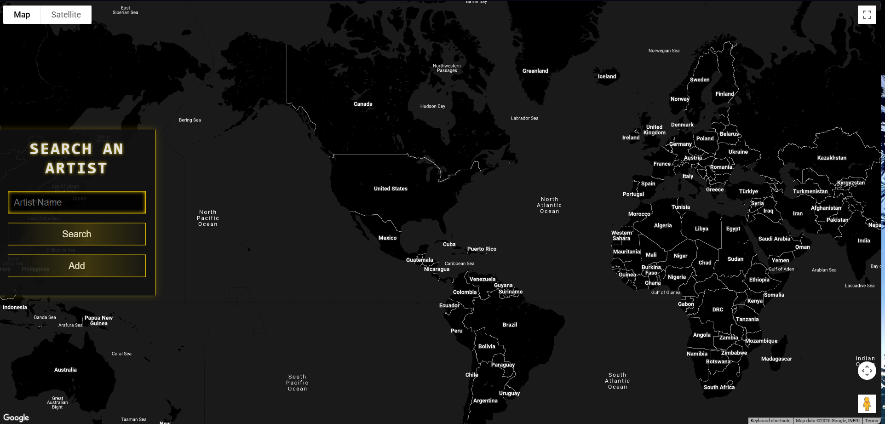
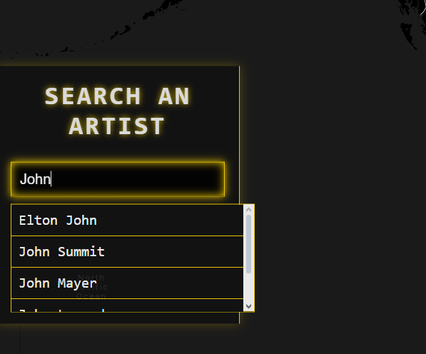
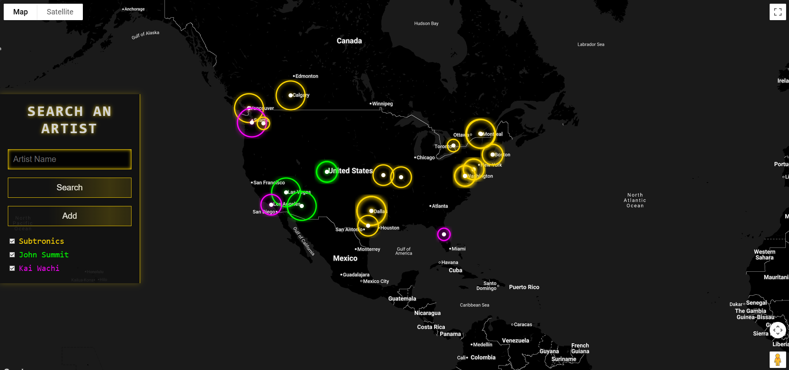
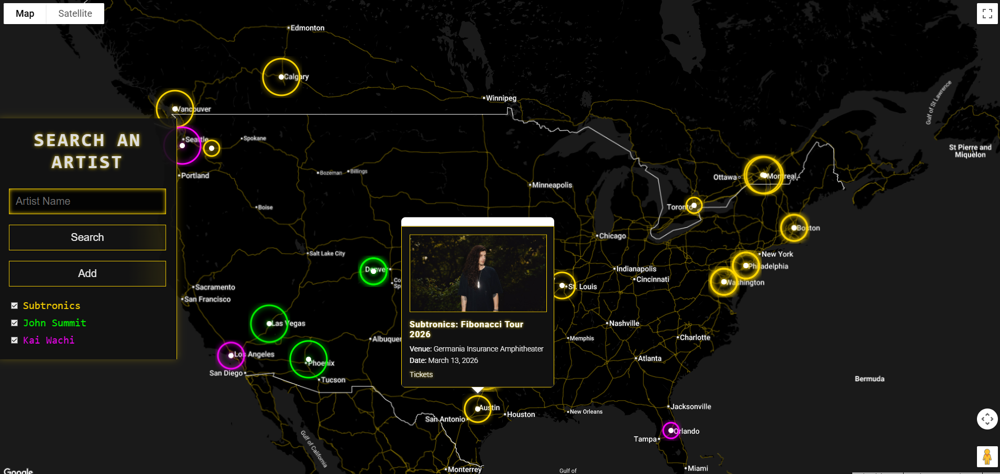

# TheSpaceStation
## Project Purpose
A web application that allows users to search for upcoming events by artist using the Ticketmaster API and display them on a Google Map.
- Search for artists and view their upcoming events.
- Interactive map with custom pin sizes based on event date (larger cirlce = closer date).
- Hoverable sidebar with artist suggestions and event management.
- Click on pins to find event information and link to buy tickets

## Demo

- Connected with the GoogleMaps JavaScript API, search any musical artist (on Ticketmaster) to display their upcoming events

- If you search an artist it will display their upcoming shows (on Ticketmaster). The larger radar circles represent events that are closer to the current date, smaller circles = farther in the future

- Provides suggestestive search results based on the artists listed on Ticketmaster

- Search multile artists at once to display on one map. Toggle on and off artists on the left side panel

- Select any radar circle to list details for that event. Click on "Tickets" to link to the website Ticketmaster has listed to buy tickets (Ticketmaster itself or specific venue websites (Red Rocks, Lost Lands, etc))
- 
## Setup 
1. **Obtain API Keys**:
   - Get a Ticketmaster API key from the [Ticketmaster Developer Portal](https://developer.ticketmaster.com/).
   - Get a Google Maps API key from the [Google Cloud Console](https://console.cloud.google.com/).

2. **Configure API Keys**:
   - Copy files "config.js" and "index.html" to local directory
   - Replace the API_KEYS in "config.js" with your API keys
  
4. **Open index.html in Web Browser**
